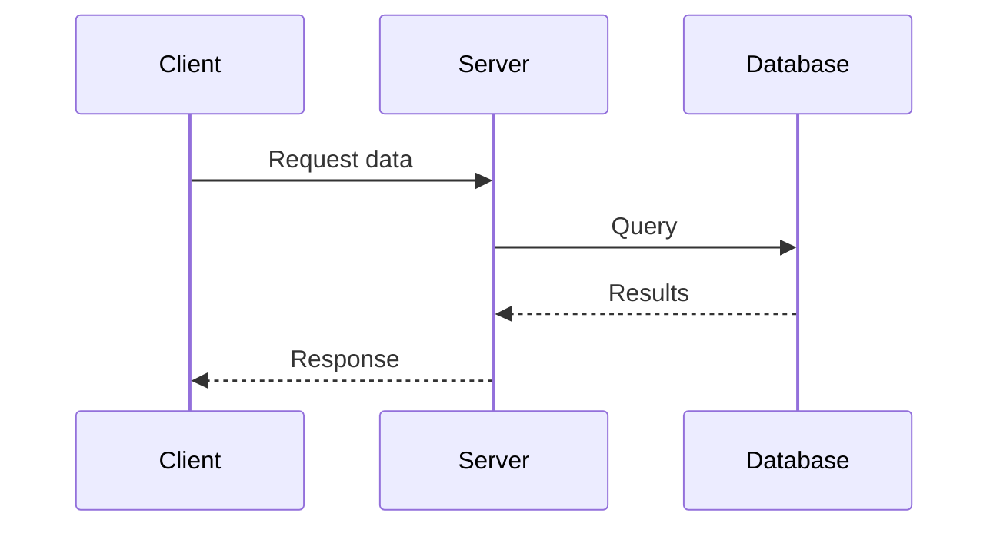

# Markdown Extensions [Features and syntax of Markdown in Vocs]

## Blockquote

To create a blockquote, add a `>` in front of a paragraph.

:::code-group
<div data-title="Preview">
> Blockquotes are very handy in email to emulate reply text.
> This line is part of the same quote.

> This is a very long line that will still be quoted properly when it wraps. Oh boy let's keep writing to make sure this is long enough to actually wrap for everyone. Oh, you can *put* **Markdown** into a blockquote. 
</div>
```md [Markdown]
> Blockquotes are very handy in email to emulate reply text.
> This line is part of the same quote.

> This is a very long line that will still be quoted properly when it wraps. Oh boy let's keep writing to make sure this is long enough to actually wrap for everyone. Oh, you can *put* **Markdown** into a blockquote. 
```
:::

## Callouts

Callouts can be rendered using one of the following [directives](https://talk.commonmark.org/t/generic-directives-plugins-syntax/444):

::::code-group
<div data-title="Preview">
:::note
This is a note callout.
:::
:::info
This is an info callout.
:::
:::warning
This is a warning callout.
:::
:::danger
This is a danger callout.
:::
:::tip
This is a tip callout.
:::
:::success
This is a success callout.
:::
</div>
````md [Markdown]
:::note
This is a note callout.
:::
:::info
This is an info callout.
:::
:::warning
This is a warning callout.
:::
:::danger
This is a danger callout.
:::
:::tip
This is a tip callout.
:::
:::success
This is a success callout.
:::
````
::::

Other markdown extensions are allowed inside callouts.

::::code-group
<div data-title="Preview">
:::note
This is a callout with code.
```tsx
console.log('hello world')
```
:::
</div>
````md [Markdown]
:::note
This is a callout with code.
```tsx
console.log('hello world')
```
:::

````
::::

## Emphasis

:::code-group
<div data-title="Preview">
Emphasis, aka italics, with *asterisks* or _underscores_.
 
Strong emphasis, aka bold, with **asterisks** or __underscores__.
 
Combined emphasis with **asterisks and _underscores_**.
 
Strikethrough uses two tildes. ~~Scratch this.~~
</div>
```md [Markdown]
Emphasis, aka italics, with *asterisks* or _underscores_.
Strong emphasis, aka bold, with **asterisks** or __underscores__.
Combined emphasis with **asterisks and _underscores_**.
Strikethrough uses two tildes. ~~Scratch this.~~
```
:::

## Footnotes

:::code-group
<div data-title="Preview">
Here is a simple footnote[^1].

A footnote can also have multiple lines[^2].  

You can also use words, to fit your writing style more closely[^note].

[^1]: My reference.
[^2]: Every new line should be prefixed with 2 spaces.  
  This allows you to have a footnote with multiple lines.
[^note]:
    Named footnotes will still render with numbers instead of the text but allow easier identification and linking.  
    This footnote also has been made with a different syntax using 4 spaces for new lines.
</div>
```md [Markdown]
Here is a simple footnote[^1].

A footnote can also have multiple lines[^2].  

You can also use words, to fit your writing style more closely[^note].

[^1]: My reference.
[^2]: Every new line should be prefixed with 2 spaces.  
  This allows you to have a footnote with multiple lines.
[^note]:
    Named footnotes will still render with numbers instead of the text but allow easier identification and linking.  
    This footnote also has been made with a different syntax using 4 spaces for new lines.
```
:::

## Frontmatter

[YAML frontmatter](https://jekyllrb.com/docs/front-matter) is supported out of the box:

```
---
title: Blogging Like a Hacker
lang: en-US
---
```

This data will be available to the rest of the page, along with all custom and theming components.

For more details, see [Frontmatter](/guide/frontmatter).

## Details

:::::code-group
<div data-title="Preview">
:::details[See more]
Lorem ipsum dolor sit amet, consectetur adipiscing elit. Fusce vestibulum ante non neque convallis tempor. Pellentesque habitant morbi tristique senectus et netus et malesuada fames ac turpis egestas.

Lorem ipsum dolor sit amet, consectetur adipiscing elit. Fusce vestibulum ante non neque convallis tempor. Pellentesque habitant morbi tristique senectus et netus et malesuada fames ac turpis egestas.

Lorem ipsum dolor sit amet, consectetur adipiscing elit. Fusce vestibulum ante non neque convallis tempor. Pellentesque habitant morbi tristique senectus et netus et malesuada fames ac turpis egestas.
:::

::::note
:::details
Lorem ipsum dolor sit amet, consectetur adipiscing elit. Fusce vestibulum ante non neque convallis tempor. Pellentesque habitant morbi tristique senectus et netus et malesuada fames ac turpis egestas.

Lorem ipsum dolor sit amet, consectetur adipiscing elit. Fusce vestibulum ante non neque convallis tempor. Pellentesque habitant morbi tristique senectus et netus et malesuada fames ac turpis egestas.

Lorem ipsum dolor sit amet, consectetur adipiscing elit. Fusce vestibulum ante non neque convallis tempor. Pellentesque habitant morbi tristique senectus et netus et malesuada fames ac turpis egestas.
:::
::::

::::danger[Error]
An error occurred!

Lorem ipsum dolor sit amet, consectetur adipiscing elit. Fusce vestibulum ante non neque convallis tempor. Pellentesque habitant morbi tristique senectus et netus et malesuada fames ac turpis egestas.

Lorem ipsum dolor sit amet, consectetur adipiscing elit. Fusce vestibulum ante non neque convallis tempor. Pellentesque habitant morbi tristique senectus et netus et malesuada fames ac turpis egestas.

:::details[Stack trace]
Lorem ipsum dolor sit amet, consectetur adipiscing elit. Fusce vestibulum ante non neque convallis tempor. Pellentesque habitant morbi tristique senectus et netus et malesuada fames ac turpis egestas.

Lorem ipsum dolor sit amet, consectetur adipiscing elit. Fusce vestibulum ante non neque convallis tempor. Pellentesque habitant morbi tristique senectus et netus et malesuada fames ac turpis egestas.

Lorem ipsum dolor sit amet, consectetur adipiscing elit. Fusce vestibulum ante non neque convallis tempor. Pellentesque habitant morbi tristique senectus et netus et malesuada fames ac turpis egestas.
:::
::::
</div>
```md [Markdown]
:::details[See more]
Lorem ipsum dolor sit amet, consectetur adipiscing elit. Fusce vestibulum ante non neque convallis tempor. Pellentesque habitant morbi tristique senectus et netus et malesuada fames ac turpis egestas.

Lorem ipsum dolor sit amet, consectetur adipiscing elit. Fusce vestibulum ante non neque convallis tempor. Pellentesque habitant morbi tristique senectus et netus et malesuada fames ac turpis egestas.

Lorem ipsum dolor sit amet, consectetur adipiscing elit. Fusce vestibulum ante non neque convallis tempor. Pellentesque habitant morbi tristique senectus et netus et malesuada fames ac turpis egestas.
:::

::::note
:::details
Lorem ipsum dolor sit amet, consectetur adipiscing elit. Fusce vestibulum ante non neque convallis tempor. Pellentesque habitant morbi tristique senectus et netus et malesuada fames ac turpis egestas.

Lorem ipsum dolor sit amet, consectetur adipiscing elit. Fusce vestibulum ante non neque convallis tempor. Pellentesque habitant morbi tristique senectus et netus et malesuada fames ac turpis egestas.

Lorem ipsum dolor sit amet, consectetur adipiscing elit. Fusce vestibulum ante non neque convallis tempor. Pellentesque habitant morbi tristique senectus et netus et malesuada fames ac turpis egestas.
:::
::::

::::danger[Error]
An error occurred!

Lorem ipsum dolor sit amet, consectetur adipiscing elit. Fusce vestibulum ante non neque convallis tempor. Pellentesque habitant morbi tristique senectus et netus et malesuada fames ac turpis egestas.

Lorem ipsum dolor sit amet, consectetur adipiscing elit. Fusce vestibulum ante non neque convallis tempor. Pellentesque habitant morbi tristique senectus et netus et malesuada fames ac turpis egestas.

:::details[Stack trace]
Lorem ipsum dolor sit amet, consectetur adipiscing elit. Fusce vestibulum ante non neque convallis tempor. Pellentesque habitant morbi tristique senectus et netus et malesuada fames ac turpis egestas.

Lorem ipsum dolor sit amet, consectetur adipiscing elit. Fusce vestibulum ante non neque convallis tempor. Pellentesque habitant morbi tristique senectus et netus et malesuada fames ac turpis egestas.

Lorem ipsum dolor sit amet, consectetur adipiscing elit. Fusce vestibulum ante non neque convallis tempor. Pellentesque habitant morbi tristique senectus et netus et malesuada fames ac turpis egestas.
:::
::::
```
:::::

## File Tree

File tree with icons based on the filename, emphasis via `**filename**`, and comments.

::::code-group
<div data-title="Preview">
:::file-tree
- +app the directory for your app
  - +[id]
    - page.tsx
    - **page.txt**
  - +folder
    - page.txt
  - layout.tsx an important file
  - page.tsx
  - global.css
  - ...
  - main.rs lol why is this here
- +components
- package.json
:::
</div>
```md [Markdown]
:::file-tree
- +app the directory for your app
  - +[id]
    - page.tsx
    - **page.txt**
  - +folder
    - page.txt
  - layout.tsx an important file
  - page.tsx
  - global.css
  - ...
  - main.rs lol why is this here
- +components
- package.json
:::
```
::::

## Headings

Headers automatically get anchor links applied.

:::code-group
```md [Markdown]
# Heading 1
## Heading 2
### Heading 3
#### Heading 4
##### Heading 5
###### Heading 6
```
:::

## Images

:::code-group
<div data-title="Preview">

</div>
```md [Markdown]

```
:::

## Inline Code

:::code-group
<div data-title="Preview">
Inline `code` has `back-ticks around` it.

Inline [`code`]() with link.

Inline `console.log("hello world"){:js}` highlighted code
</div>
```md [Markdown]
Inline `code` has `back-ticks around` it.
Inline [`code`]() with link.
Inline `console.log("hello world"){:js}` highlighted code
```
:::

## Links

Both internal and external links get special treatment. Internal links are converted to router links for navigation. Outbound links automatically get `target="_blank" rel="noreferrer"`.

:::code-group
<div data-title="Preview">
[Internal link](/guide/markdown-extensions)

[External link](https://example.com)

www.example.com, https://example.com, and contact@example.com.

[Dead link](/foo-bar-baz)
</div>
```md [Markdown]
[Internal link](/guide/markdown-extensions)
[External link](https://example.com)
www.example.com, https://example.com, and contact@example.com.
[Dead link](/foo-bar-baz)
```
:::

## Lists

:::code-group
<div data-title="Preview">
1. First ordered list item
2. Another item
3. Actual numbers don't matter, just that it's a number
    1. Ordered sub-list
        1. Ordered sub-list
    2. Ordered sub-list
    3. Ordered sub-list
4. And another item.

* First item
  * Sub list
    * Sub list
    * Sub list
  * Sub list
* Second item
  * Sub list
* Third item

* [ ] to do
* [x] done
</div>
```md [Markdown]
1. First ordered list item
2. Another item
3. Actual numbers don't matter, just that it's a number
    1. Ordered sub-list
        1. Ordered sub-list
    2. Ordered sub-list
    3. Ordered sub-list
4. And another item.

* First item
  * Sub list
    * Sub list
    * Sub list
  * Sub list
* Second item
  * Sub list
* Third item

* [ ] to do
* [x] done
```
:::

## Markdown Snippets

:::code-group
<div data-title="Preview">
</div>
```md [Markdown]
```
:::

## Mermaid Diagrams

:::code-group
<div data-title="Preview">

</div>
````md [Markdown]

````
:::

## Steps

:::::code-group
<div data-title="Preview">
::::steps
##### Step one

Lorem ipsum dolor sit amet, consectetur adipiscing elit. Fusce vestibulum ante non neque convallis tempor. Pellentesque habitant morbi tristique senectus et netus et malesuada fames ac turpis egestas. Nam a iaculis libero.

##### Step two

Lorem ipsum dolor sit amet, consectetur adipiscing elit. Fusce vestibulum ante non neque convallis tempor. Pellentesque habitant morbi tristique senectus et netus et malesuada fames ac turpis egestas. Nam a iaculis libero.

:::code-group
```tsx [console.log]
console.log('hello world')
```

```tsx [alert]
alert('hello world')
```
:::

:::info
test

```tsx
console.log('hi')
```
:::

##### Step three

Lorem ipsum dolor sit amet, consectetur adipiscing elit. Fusce vestibulum ante non neque convallis tempor. Pellentesque habitant morbi tristique senectus et netus et malesuada fames ac turpis egestas. Nam a iaculis libero.
::::
</div>
````md [Markdown]
::::steps
##### Step one

Lorem ipsum dolor sit amet, consectetur adipiscing elit. Fusce vestibulum ante non neque convallis tempor. Pellentesque habitant morbi tristique senectus et netus et malesuada fames ac turpis egestas. Nam a iaculis libero.

##### Step two

Lorem ipsum dolor sit amet, consectetur adipiscing elit. Fusce vestibulum ante non neque convallis tempor. Pellentesque habitant morbi tristique senectus et netus et malesuada fames ac turpis egestas. Nam a iaculis libero.

:::code-group
```tsx [console.log]
console.log('hello world')
```

```tsx [alert]
alert('hello world')
```
:::

:::info
test

```tsx
console.log('hi')
```
:::

##### Step three

Lorem ipsum dolor sit amet, consectetur adipiscing elit. Fusce vestibulum ante non neque convallis tempor. Pellentesque habitant morbi tristique senectus et netus et malesuada fames ac turpis egestas. Nam a iaculis libero.
::::
````
:::::

## Tables

:::code-group
<div data-title="Preview">
| Tables        | Are           | Cool  |
| ------------- |:-------------:| -----:|
| col 3 is      | right-aligned | $1600 |
| col 2 is      | centered      |   $12 |
| zebra stripes | are neat      |    $1 |
</div>
```md [Markdown]
| Tables        | Are           | Cool  |
| ------------- |:-------------:| -----:|
| col 3 is      | right-aligned | $1600 |
| col 2 is      | centered      |   $12 |
| zebra stripes | are neat      |    $1 |
```
:::
