# Mermaid Diagrams [Render diagrams from code using beautiful-mermaid]

Vocs supports [Mermaid](https://mermaid.js.org/) diagrams via [`beautiful-mermaid`](https://github.com/lukilabs/beautiful-mermaid) — a fast, themeable renderer that outputs clean SVGs.

Wrap diagram code in a `mermaid` code block:

````md
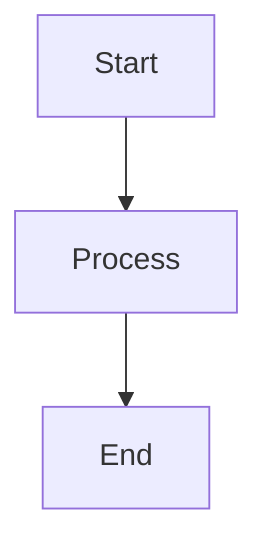
````

## Flowcharts

### Simple Flow


### Node Shapes

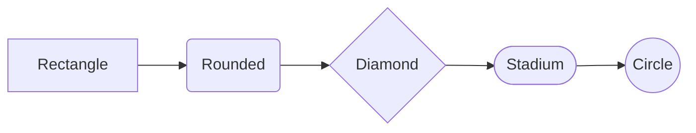

### All Flowchart Shapes

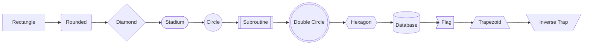

### Subgraphs

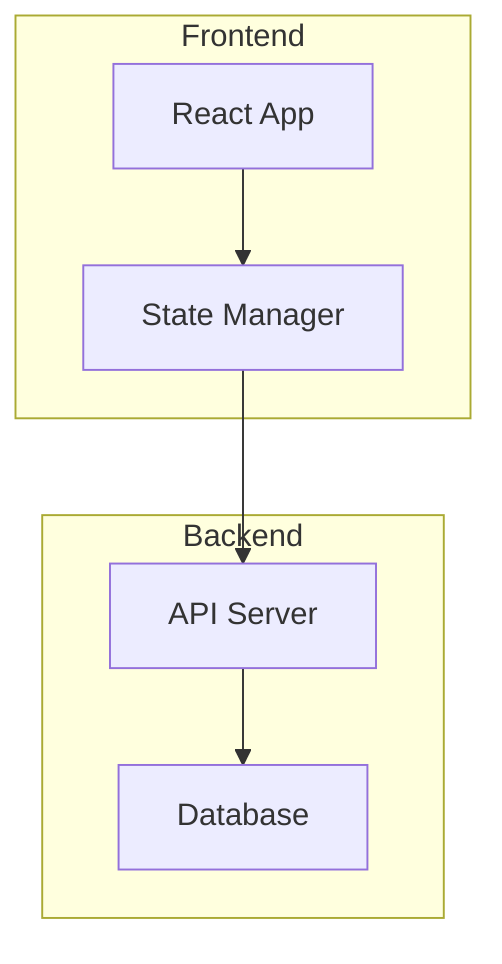

## State Diagrams

### Basic State Diagram

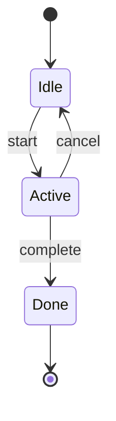

### Composite States

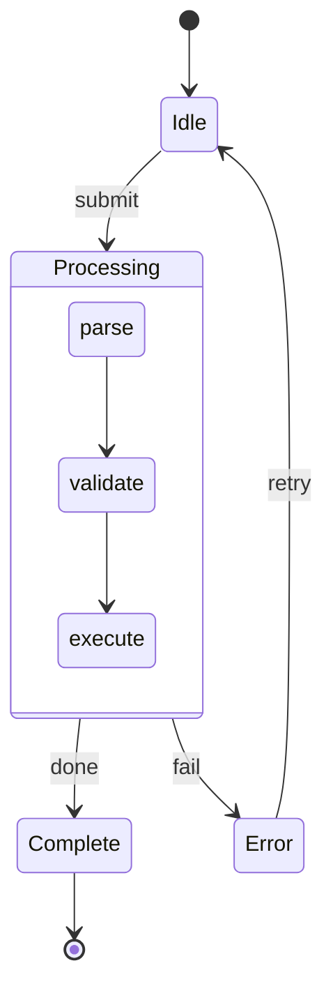

## Sequence Diagrams

### Basic Messages

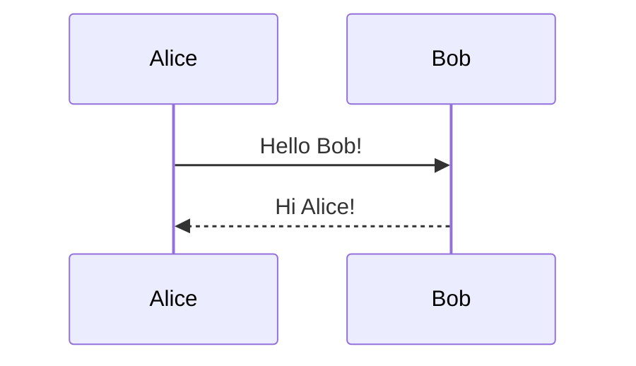

### Participant Aliases

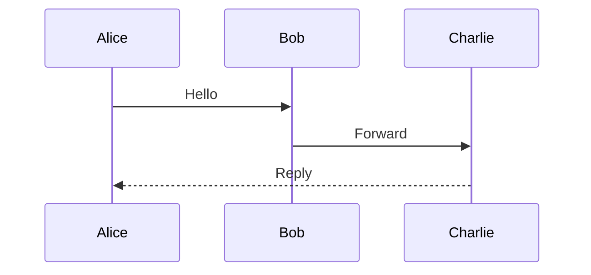

### Arrow Types

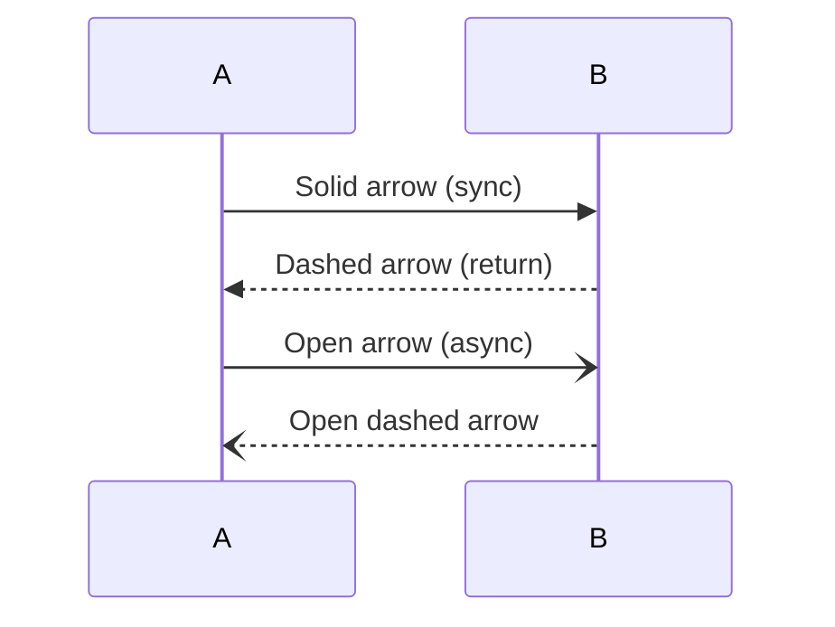

### Activation Boxes

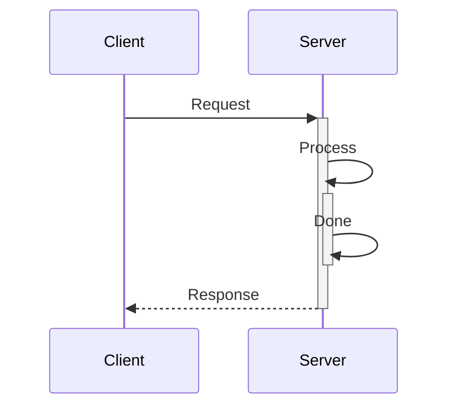

### Self-Messages

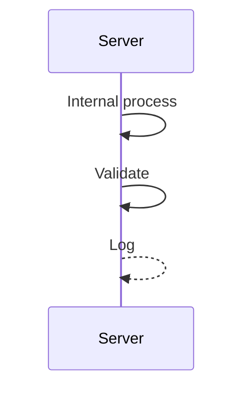

### Opt Block

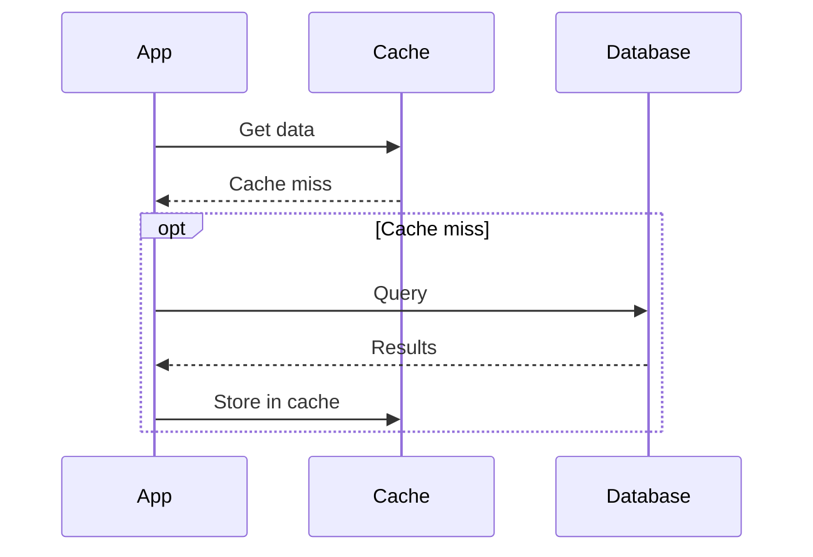

### Par Block

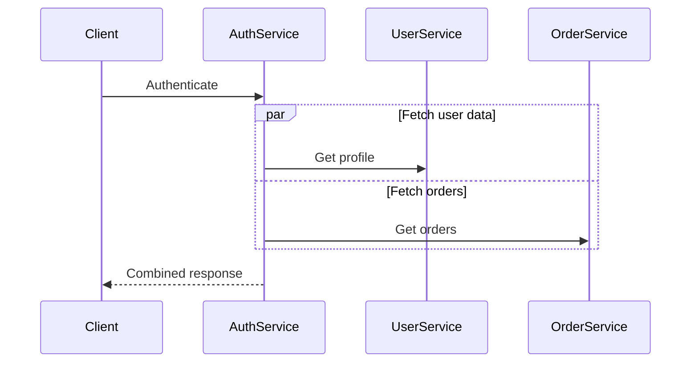

### Notes

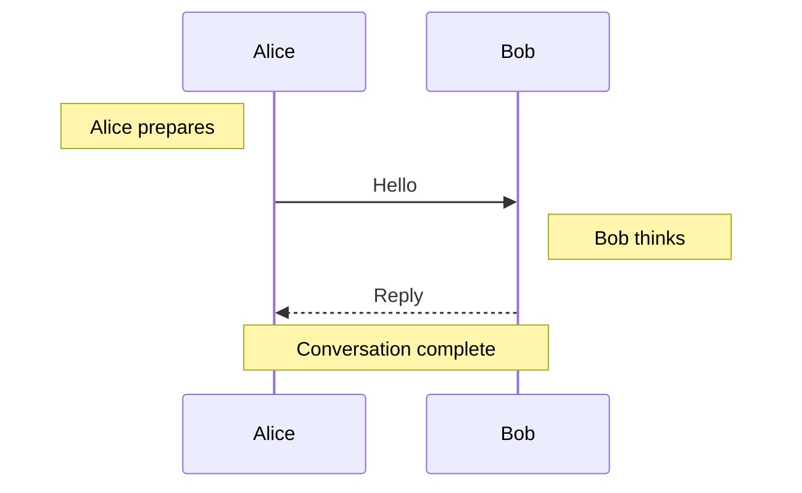

### OAuth 2.0 Flow

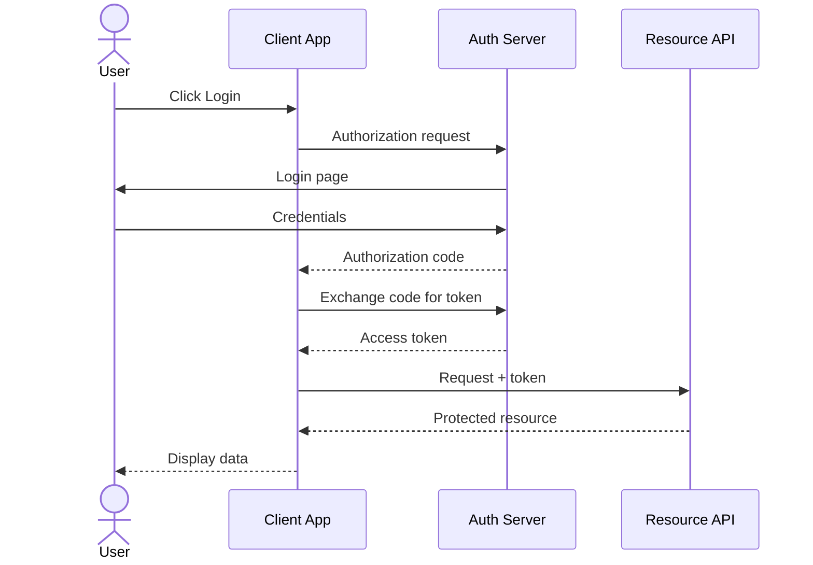

### Microservice Orchestration

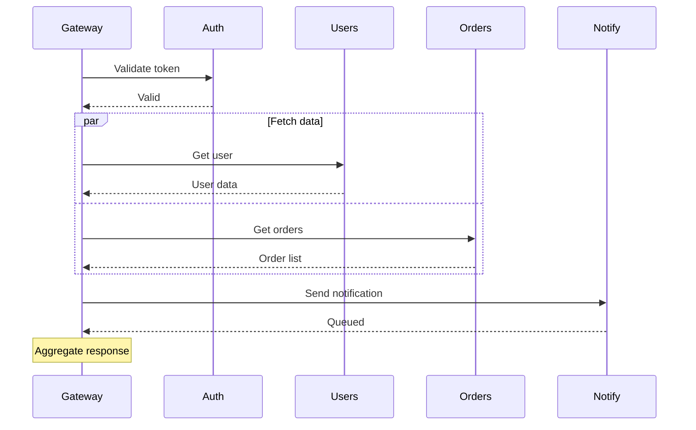

## Class Diagrams

### Basic Class

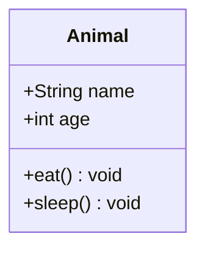

### Visibility Markers

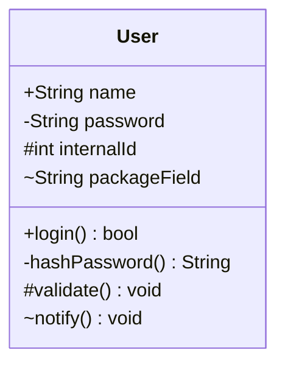

### Interface Annotation

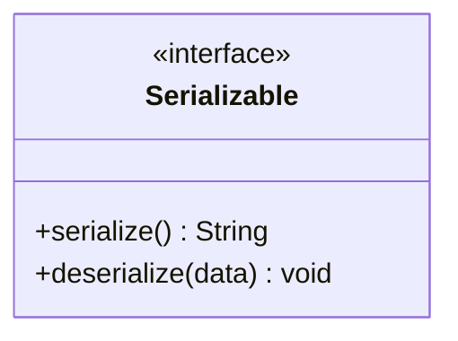

### Abstract Annotation

```mermaid
classDiagram
  class Shape {
    <<abstract>>
    +String color
    +area() double
    +draw() void
  }
```

### Enum Annotation

```mermaid
classDiagram
  class Status {
    <<enumeration>>
    ACTIVE
    INACTIVE
    PENDING
    DELETED
  }
```

### Inheritance

```mermaid
classDiagram
  class Animal {
    +String name
    +eat() void
  }
  class Dog {
    +String breed
    +bark() void
  }
  class Cat {
    +bool isIndoor
    +meow() void
  }
  Animal <|-- Dog
  Animal <|-- Cat
```

### Composition

```mermaid
classDiagram
  class Car {
    +String model
    +start() void
  }
  class Engine {
    +int horsepower
    +rev() void
  }
  Car *-- Engine
```

### Aggregation

```mermaid
classDiagram
  class University {
    +String name
  }
  class Department {
    +String faculty
  }
  University o-- Department
```

### All Relationship Types

```mermaid
classDiagram
  A <|-- B : inheritance
  C *-- D : composition
  E o-- F : aggregation
  G --> H : association
  I ..> J : dependency
  K ..|> L : realization
```

### MVC Architecture

```mermaid
classDiagram
  class Model {
    -data Map
    +getData() Map
    +setData(key, val) void
    +notify() void
  }
  class View {
    -model Model
    +render() void
    +update() void
  }
  class Controller {
    -model Model
    -view View
    +handleInput(event) void
    +updateModel(data) void
  }
  Controller --> Model : updates
  Controller --> View : refreshes
  View --> Model : reads
  Model ..> View : notifies
```

### Full Hierarchy

```mermaid
classDiagram
  class Animal {
    <<abstract>>
    +String name
    +int age
    +eat() void
    +sleep() void
  }
  class Mammal {
    +bool warmBlooded
    +nurse() void
  }
  class Bird {
    +bool canFly
    +layEggs() void
  }
  class Dog {
    +String breed
    +bark() void
  }
  class Cat {
    +bool isIndoor
    +purr() void
  }
  class Parrot {
    +String vocabulary
    +speak() void
  }
  Animal <|-- Mammal
  Animal <|-- Bird
  Mammal <|-- Dog
  Mammal <|-- Cat
  Bird <|-- Parrot
```

## ER Diagrams

### Basic Relationship

```mermaid
erDiagram
  CUSTOMER ||--o{ ORDER : places
```

### Entity with Attributes

```mermaid
erDiagram
  CUSTOMER {
    int id PK
    string name
    string email UK
    date created_at
  }
```

### All Cardinality Types

```mermaid
erDiagram
  A ||--|| B : one-to-one
  C ||--o{ D : one-to-many
  E |o--|{ F : opt-to-many
  G }|--o{ H : many-to-many
```

### Identifying vs Non-Identifying

```mermaid
erDiagram
  ORDER ||--|{ LINE_ITEM : contains
  ORDER ||..o{ SHIPMENT : ships-via
  PRODUCT ||--o{ LINE_ITEM : includes
  PRODUCT ||..o{ REVIEW : receives
```

### School Management Schema

```mermaid
erDiagram
  STUDENT {
    int id PK
    string name
    date dob
    string grade
  }
  TEACHER {
    int id PK
    string name
    string department
  }
  COURSE {
    int id PK
    string title
    int teacher_id FK
    int credits
  }
  ENROLLMENT {
    int id PK
    int student_id FK
    int course_id FK
    string semester
    float grade
  }
  TEACHER ||--o{ COURSE : teaches
  STUDENT ||--o{ ENROLLMENT : enrolled
  COURSE ||--o{ ENROLLMENT : has
```
