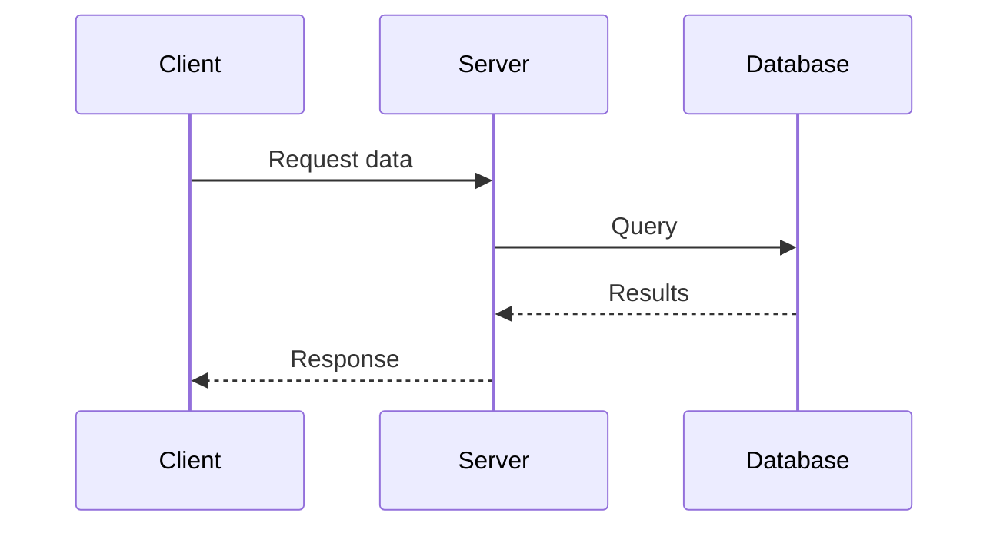

import { Card, Cards, Link, Tab, Tabs } from 'vocs'

# Markdown Extensions [Features and syntax of Markdown in Vocs]

Vocs supports standard Markdown plus directives for docs-specific UI such as callouts, steps, code groups, and file trees.

## Badges

Use the `:badge[...]` text directive for small inline status labels.

:::code-group
<div data-title="Preview">
Vocs v2 is :badge[Beta]{warning}.

The Vite plugin is :badge[Stable]{success}.

This feature is :badge[Experimental].
</div>
```md [Markdown]
Vocs v2 is :badge[Beta]{warning}.

The Vite plugin is :badge[Stable]{success}.

This feature is :badge[Experimental].
```
:::

## Blockquote

To create a blockquote, add a `>` in front of a paragraph.

:::code-group
<div data-title="Preview">
> Quoted text can span multiple lines.
> This line is part of the same quote.

> Long quoted lines still wrap correctly, and you can use *Markdown* inside a blockquote.
</div>
```md [Markdown]
> Quoted text can span multiple lines.
> This line is part of the same quote.

> Long quoted lines still wrap correctly, and you can use *Markdown* inside a blockquote.
```
:::

## Callouts

Use one of the following [directives](https://talk.commonmark.org/t/generic-directives-plugins-syntax/444), or the generic `callout` directive, to render callouts:

::::code-group
<div data-title="Preview">
:::note
This is a note callout.
:::
:::info
This is an info callout.
:::
:::warning
This is a warning callout.
:::
:::danger
This is a danger callout.
:::
:::tip
This is a tip callout.
:::
:::success
This is a success callout.
:::
</div>
````md [Markdown]
:::note
This is a note callout.
:::
:::info
This is an info callout.
:::
:::warning
This is a warning callout.
:::
:::danger
This is a danger callout.
:::
:::tip
This is a tip callout.
:::
:::success
This is a success callout.
:::
````
::::

Callouts can also have custom titles.

::::code-group
<div data-title="Preview">
:::callout[Heads up]
This is a generic info callout with a custom title.
:::

:::warning[Breaking change]
This warning callout has a custom title.
:::
</div>
````md [Markdown]
:::callout[Heads up]
This is a generic info callout with a custom title.
:::

:::warning[Breaking change]
This warning callout has a custom title.
:::
````
::::

Other Markdown extensions can appear inside callouts.

::::code-group
<div data-title="Preview">
:::note
This is a callout with code.
```tsx
console.log('hello world')
```
:::
</div>
````md [Markdown]
:::note
This is a callout with code.
```tsx
console.log('hello world')
```
:::

````
::::

## Cards

Use `Cards` and `Card` to build linked grids for related pages.

:::code-group
<div data-title="Preview">
<Cards>
  <Card
    title="Getting Started"
    description="Create your first Vocs site."
    icon="book-open"
    to="/introduction/getting-started"
  />
  <Card
    title="Site Config"
    description="Configure navigation, metadata, and AI access."
    icon="settings"
    to="/reference/site-config"
  />
</Cards>
</div>
```mdx [MDX]
import { Card, Cards } from 'vocs'

<Cards>
  <Card
    title="Getting Started"
    description="Create your first Vocs site."
    icon="book-open"
    to="/introduction/getting-started"
  />
  <Card
    title="Site Config"
    description="Configure navigation, metadata, and AI access."
    icon="settings"
    to="/reference/site-config"
  />
</Cards>
```
:::

## Details

:::::code-group
<div data-title="Preview">
:::details[See more]
Lorem ipsum dolor sit amet, consectetur adipiscing elit. Fusce vestibulum ante non neque convallis tempor. Pellentesque habitant morbi tristique senectus et netus et malesuada fames ac turpis egestas.

Lorem ipsum dolor sit amet, consectetur adipiscing elit. Fusce vestibulum ante non neque convallis tempor. Pellentesque habitant morbi tristique senectus et netus et malesuada fames ac turpis egestas.

Lorem ipsum dolor sit amet, consectetur adipiscing elit. Fusce vestibulum ante non neque convallis tempor. Pellentesque habitant morbi tristique senectus et netus et malesuada fames ac turpis egestas.
:::

::::note
:::details
Lorem ipsum dolor sit amet, consectetur adipiscing elit. Fusce vestibulum ante non neque convallis tempor. Pellentesque habitant morbi tristique senectus et netus et malesuada fames ac turpis egestas.

Lorem ipsum dolor sit amet, consectetur adipiscing elit. Fusce vestibulum ante non neque convallis tempor. Pellentesque habitant morbi tristique senectus et netus et malesuada fames ac turpis egestas.

Lorem ipsum dolor sit amet, consectetur adipiscing elit. Fusce vestibulum ante non neque convallis tempor. Pellentesque habitant morbi tristique senectus et netus et malesuada fames ac turpis egestas.
:::
::::

::::danger[Error]
An error occurred!

Lorem ipsum dolor sit amet, consectetur adipiscing elit. Fusce vestibulum ante non neque convallis tempor. Pellentesque habitant morbi tristique senectus et netus et malesuada fames ac turpis egestas.

Lorem ipsum dolor sit amet, consectetur adipiscing elit. Fusce vestibulum ante non neque convallis tempor. Pellentesque habitant morbi tristique senectus et netus et malesuada fames ac turpis egestas.

:::details[Stack trace]
Lorem ipsum dolor sit amet, consectetur adipiscing elit. Fusce vestibulum ante non neque convallis tempor. Pellentesque habitant morbi tristique senectus et netus et malesuada fames ac turpis egestas.

Lorem ipsum dolor sit amet, consectetur adipiscing elit. Fusce vestibulum ante non neque convallis tempor. Pellentesque habitant morbi tristique senectus et netus et malesuada fames ac turpis egestas.

Lorem ipsum dolor sit amet, consectetur adipiscing elit. Fusce vestibulum ante non neque convallis tempor. Pellentesque habitant morbi tristique senectus et netus et malesuada fames ac turpis egestas.
:::
::::
</div>
```md [Markdown]
:::details[See more]
Lorem ipsum dolor sit amet, consectetur adipiscing elit. Fusce vestibulum ante non neque convallis tempor. Pellentesque habitant morbi tristique senectus et netus et malesuada fames ac turpis egestas.

Lorem ipsum dolor sit amet, consectetur adipiscing elit. Fusce vestibulum ante non neque convallis tempor. Pellentesque habitant morbi tristique senectus et netus et malesuada fames ac turpis egestas.

Lorem ipsum dolor sit amet, consectetur adipiscing elit. Fusce vestibulum ante non neque convallis tempor. Pellentesque habitant morbi tristique senectus et netus et malesuada fames ac turpis egestas.
:::

::::note
:::details
Lorem ipsum dolor sit amet, consectetur adipiscing elit. Fusce vestibulum ante non neque convallis tempor. Pellentesque habitant morbi tristique senectus et netus et malesuada fames ac turpis egestas.

Lorem ipsum dolor sit amet, consectetur adipiscing elit. Fusce vestibulum ante non neque convallis tempor. Pellentesque habitant morbi tristique senectus et netus et malesuada fames ac turpis egestas.

Lorem ipsum dolor sit amet, consectetur adipiscing elit. Fusce vestibulum ante non neque convallis tempor. Pellentesque habitant morbi tristique senectus et netus et malesuada fames ac turpis egestas.
:::
::::

::::danger[Error]
An error occurred!

Lorem ipsum dolor sit amet, consectetur adipiscing elit. Fusce vestibulum ante non neque convallis tempor. Pellentesque habitant morbi tristique senectus et netus et malesuada fames ac turpis egestas.

Lorem ipsum dolor sit amet, consectetur adipiscing elit. Fusce vestibulum ante non neque convallis tempor. Pellentesque habitant morbi tristique senectus et netus et malesuada fames ac turpis egestas.

:::details[Stack trace]
Lorem ipsum dolor sit amet, consectetur adipiscing elit. Fusce vestibulum ante non neque convallis tempor. Pellentesque habitant morbi tristique senectus et netus et malesuada fames ac turpis egestas.

Lorem ipsum dolor sit amet, consectetur adipiscing elit. Fusce vestibulum ante non neque convallis tempor. Pellentesque habitant morbi tristique senectus et netus et malesuada fames ac turpis egestas.

Lorem ipsum dolor sit amet, consectetur adipiscing elit. Fusce vestibulum ante non neque convallis tempor. Pellentesque habitant morbi tristique senectus et netus et malesuada fames ac turpis egestas.
:::
::::
```
:::::

## Emphasis

:::code-group
<div data-title="Preview">
Emphasis, aka italics, with *asterisks* or _underscores_.
 
Strong emphasis, aka bold, with **asterisks** or __underscores__.
 
Combined emphasis with **asterisks and _underscores_**.
 
Strikethrough uses two tildes. ~~Scratch this.~~
</div>
```md [Markdown]
Emphasis, aka italics, with *asterisks* or _underscores_.
Strong emphasis, aka bold, with **asterisks** or __underscores__.
Combined emphasis with **asterisks and _underscores_**.
Strikethrough uses two tildes. ~~Scratch this.~~
```
:::

## FeedbackWidget

Use `FeedbackWidget` when you want to render the configured feedback UI manually.

:::code-group
```mdx [MDX]
import { FeedbackWidget } from 'vocs'

<FeedbackWidget />
```
:::

## File Tree

File tree with icons based on the filename, emphasis via `**filename**`, and comments.

::::code-group
<div data-title="Preview">
:::file-tree
- +app the directory for your app
  - +[id]
    - page.tsx
    - **page.txt**
  - +folder
    - page.txt
  - layout.tsx an important file
  - page.tsx
  - global.css
  - ...
  - main.rs lol why is this here
- +components
- package.json
:::
</div>
```md [Markdown]
:::file-tree
- +app the directory for your app
  - +[id]
    - page.tsx
    - **page.txt**
  - +folder
    - page.txt
  - layout.tsx an important file
  - page.tsx
  - global.css
  - ...
  - main.rs lol why is this here
- +components
- package.json
:::
```
::::

## Footnotes

Use Markdown footnotes to add references without interrupting the page flow.

:::code-group
```md [Markdown]
Here is a simple footnote[^1].

A footnote can also have multiple lines[^2].  

You can also use words, to fit your writing style more closely[^note].

[^1]: My reference.
[^2]: Every new line should be prefixed with 2 spaces.  
  This allows you to have a footnote with multiple lines.
[^note]:
    Named footnotes will still render with numbers instead of the text but allow easier identification and linking.  
    This footnote also has been made with a different syntax using 4 spaces for new lines.
```
:::

## Frontmatter

[YAML frontmatter](https://jekyllrb.com/docs/front-matter) is supported:

```
---
title: Blogging Like a Hacker
lang: en-US
---
```

This data will be available to the rest of the page, along with all custom and theming components.

For more details, see [Frontmatter](/writing/frontmatter).

## Headings

Headers automatically get anchor links applied.

:::code-group
```md [Markdown]
# Heading 1
## Heading 2
### Heading 3
#### Heading 4
##### Heading 5
###### Heading 6
```
:::

Headings can also include subtext using `# Title [Description]`.

:::code-group
<div data-title="Preview">
# Deploy Contracts [Ship Solidity apps with Vite-native docs]
</div>
```md [Markdown]
# Deploy Contracts [Ship Solidity apps with Vite-native docs]
```
:::

Vocs renders the bracketed text as page subtext and uses it to fill in default `title` and `description` frontmatter when those values are not set explicitly.

## Images

:::code-group
<div data-title="Preview">

</div>
```md [Markdown]

```
:::

Local images from the `public` directory automatically get `width` and `height` attributes to prevent layout shift during loading:

:::code-group
<div data-title="Preview">

</div>
```md [Markdown]

```
:::

## Link

Use `Link` when internal navigation needs to be composed from JSX.

:::code-group
<div data-title="Preview">
<Link to="/introduction/getting-started">Get started</Link>
</div>
```mdx [MDX]
import { Link } from 'vocs'

<Link to="/introduction/getting-started">Get started</Link>
```
:::

## Links

Both internal and external links get special treatment. Internal links are converted to router links for navigation. Outbound links automatically get `target="_blank" rel="noreferrer"`.

:::code-group
<div data-title="Preview">
[Internal link](/writing/markdown-extensions)

[External link](https://example.com)

www.example.com, https://example.com, and contact@example.com.

[Reference link](/reference/site-config#metadata)
</div>
```md [Markdown]
[Internal link](/writing/markdown-extensions)
[External link](https://example.com)
www.example.com, https://example.com, and contact@example.com.
[Reference link](/reference/site-config#metadata)
```
:::

## Lists

:::code-group
<div data-title="Preview">
1. First ordered list item
2. Another item
3. Third ordered list item
    1. Ordered sub-list
        1. Ordered sub-list
    2. Ordered sub-list
    3. Ordered sub-list
4. And another item.

* First item
  * Sub list
    * Sub list
    * Sub list
  * Sub list
* Second item
  * Sub list
* Third item

* [ ] to do
* [x] done
</div>
```md [Markdown]
1. First ordered list item
2. Another item
3. Third ordered list item
    1. Ordered sub-list
        1. Ordered sub-list
    2. Ordered sub-list
    3. Ordered sub-list
4. And another item.

* First item
  * Sub list
    * Sub list
    * Sub list
  * Sub list
* Second item
  * Sub list
* Third item

* [ ] to do
* [x] done
```
:::

## Mermaid Diagrams

:::code-group
<div data-title="Preview">

</div>
````md [Markdown]

````
:::

## Quick Prompt

Ask your AI agent to read this guide before editing Markdown or MDX pages:

```txt
Read https://vocs.dev/writing/markdown-extensions and update this page using the right Vocs Markdown syntax.
```

:::tip
Prefer built-in Vocs directives over raw HTML for callouts, code groups, steps, details, file trees, and badges. Directives keep pages consistent and easier for agents to edit.
:::

## Steps

:::::code-group
<div data-title="Preview">
::::steps
##### Step one

Lorem ipsum dolor sit amet, consectetur adipiscing elit. Fusce vestibulum ante non neque convallis tempor. Pellentesque habitant morbi tristique senectus et netus et malesuada fames ac turpis egestas. Nam a iaculis libero.

##### Step two

Lorem ipsum dolor sit amet, consectetur adipiscing elit. Fusce vestibulum ante non neque convallis tempor. Pellentesque habitant morbi tristique senectus et netus et malesuada fames ac turpis egestas. Nam a iaculis libero.

:::code-group
```tsx [console.log]
console.log('hello world')
```

```tsx [alert]
alert('hello world')
```
:::

:::info
test

```tsx
console.log('hi')
```
:::

##### Step three

Lorem ipsum dolor sit amet, consectetur adipiscing elit. Fusce vestibulum ante non neque convallis tempor. Pellentesque habitant morbi tristique senectus et netus et malesuada fames ac turpis egestas. Nam a iaculis libero.
::::
</div>
````md [Markdown]
::::steps
##### Step one

Lorem ipsum dolor sit amet, consectetur adipiscing elit. Fusce vestibulum ante non neque convallis tempor. Pellentesque habitant morbi tristique senectus et netus et malesuada fames ac turpis egestas. Nam a iaculis libero.

##### Step two

Lorem ipsum dolor sit amet, consectetur adipiscing elit. Fusce vestibulum ante non neque convallis tempor. Pellentesque habitant morbi tristique senectus et netus et malesuada fames ac turpis egestas. Nam a iaculis libero.

:::code-group
```tsx [console.log]
console.log('hello world')
```

```tsx [alert]
alert('hello world')
```
:::

:::info
test

```tsx
console.log('hi')
```
:::

##### Step three

Lorem ipsum dolor sit amet, consectetur adipiscing elit. Fusce vestibulum ante non neque convallis tempor. Pellentesque habitant morbi tristique senectus et netus et malesuada fames ac turpis egestas. Nam a iaculis libero.
::::
````
:::::

## Tables

:::code-group
<div data-title="Preview">
| Tables        | Are           | Cool  |
| ------------- |:-------------:| -----:|
| col 3 is      | right-aligned | $1600 |
| col 2 is      | centered      |   $12 |
| zebra stripes | are neat      |    $1 |
</div>
```md [Markdown]
| Tables        | Are           | Cool  |
| ------------- |:-------------:| -----:|
| col 3 is      | right-aligned | $1600 |
| col 2 is      | centered      |   $12 |
| zebra stripes | are neat      |    $1 |
```
:::

## Tabs

Use `Tabs` and `Tab` to switch between related content.

:::code-group
<div data-title="Preview">
<Tabs stateKey="markdown-tabs-preview">
  <Tab title="Agent">Use a quick prompt for repeatable edits.</Tab>
  <Tab title="Author">Write Markdown and drop into JSX when needed.</Tab>
</Tabs>
</div>
```mdx [MDX]
import { Tab, Tabs } from 'vocs'

<Tabs stateKey="workflow">
  <Tab title="Agent">Use a quick prompt for repeatable edits.</Tab>
  <Tab title="Author">Write Markdown and drop into JSX when needed.</Tab>
</Tabs>
```
:::
