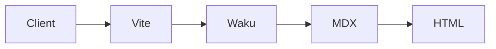
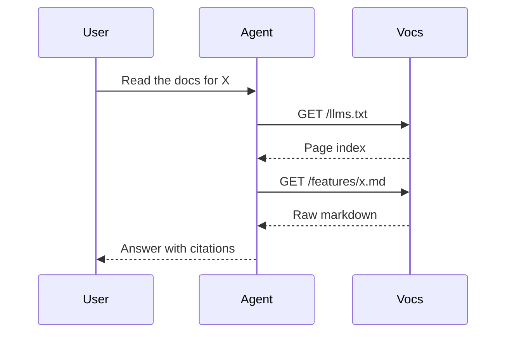
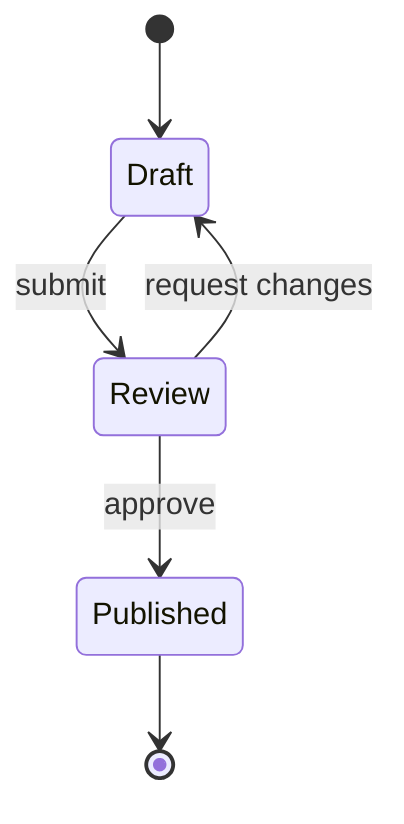
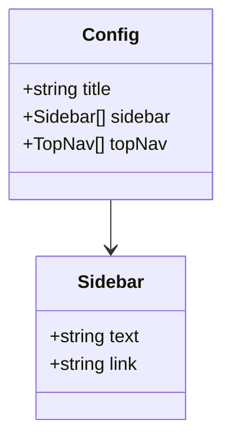

import { Card, Cards } from 'vocs'

# Mermaid Diagrams [Render diagrams from text using Mermaid]

## Usage

Write Mermaid syntax inside a `mermaid` code block:

````mdx

````

The block renders as an SVG diagram with built-in light/dark theming, loading states, and error fallbacks:


## Supported Diagrams

Vocs supports the full Mermaid syntax, including:

- **Flowcharts** (`graph`, `flowchart`)
- **Sequence diagrams**
- **Class diagrams**
- **State diagrams**
- **Entity-relationship diagrams**
- **Gantt charts**
- **Pie charts**
- **Git graphs**
- **Mindmaps**
- **Timeline**
- **Quadrant charts**
- **C4 diagrams**

See the [Mermaid documentation](https://mermaid.js.org/intro/) for full syntax reference.

## Examples

### Sequence Diagram

:::code-group
<div data-title="Preview">

</div>

```text [Code]
sequenceDiagram
  participant U as User
  participant A as Agent
  participant V as Vocs

  U->>A: Read the docs for X
  A->>V: GET /llms.txt
  V-->>A: Page index
  A->>V: GET /features/x.md
  V-->>A: Raw markdown
  A-->>U: Answer with citations
```
:::

### State Diagram

:::code-group
<div data-title="Preview">

</div>

```text [Code]
stateDiagram-v2
  [*] --> Draft
  Draft --> Review: submit
  Review --> Published: approve
  Review --> Draft: request changes
  Published --> [*]
```
:::

### Class Diagram

:::code-group
<div data-title="Preview">

</div>

```text [Code]
classDiagram
  class Config {
    +string title
    +Sidebar[] sidebar
    +TopNav[] topNav
  }
  class Sidebar {
    +string text
    +string link
  }
  Config --> Sidebar
```
:::

## Theming

Mermaid diagrams inherit Vocs's light/dark color scheme automatically. Customize the diagram appearance through the [Mermaid theme variables](https://mermaid.js.org/config/theming.html) by adding `%%{init}%%` directives at the top of a diagram, or globally via your `_root.css`.

## How It Works

The remark pipeline converts `mermaid` code blocks into a `<div data-v-mermaid-chart="...">` element. A small client-side component loads `mermaid` lazily and renders the SVG into the placeholder. The Mermaid runtime is only bundled on pages that actually use a diagram.

## See More

<Cards>
  <Card
    title="Markdown Extensions"
    description="Callouts, file trees, tabs, and other MDX extensions."
    icon="file-text"
    to="/writing/markdown-extensions"
  />
  <Card
    title="Code & Syntax Highlighting"
    description="Shiki transformers, line focus, diffs, and Twoslash for regular code blocks."
    icon="code"
    to="/writing/syntax-highlighting"
  />
</Cards>
